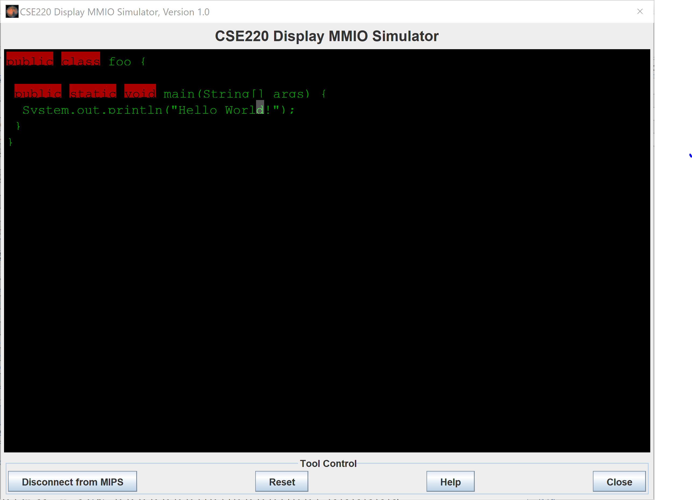

# vi Editor Written in MIPS Assembly

This program is written in MIPS Assembly and should be assembled and run in
special version of MARS(MIPS Assembler and Runtime Simulator) that is included in
this project as "Mars_Spring18.jar" in etc folder. Supplementary documents are provided in the
doc folder. Source files are in the src folder.

  

## Getting Started

1. Run "Mars_Spring18.jar" and open src/hw3_main.asm
2. To read the core code of this program, open and read src/hw3.asm
3. Open "CSE220 Display MMIO Simulator" in Tools -> CSE220 Display MMIO Simulator
4. Click "Connect to MIPS". Then, assemble and run src/hw3_main.asm. Please follow this order to prevent the program from crashing.
5. At "Run I/O", follow the prompt to enter four integers(0-7). This will choose the color of text and background. The integer to color table is in page 5 of doc/hw3.pdf
6. Type in "Run I/O" to type in Vi Editor. Commands also should be typed in "Run I/O". Commands are provided in page 8 of doc/hw3.pdf
7. Key syntaxes will be highlighted with your chosen color
8. To quit the editor, click stop in MARS, click "Disconnect from MIPS" in simulator, then close the simulator. Please follow this order to prevent the program from crashing
9. Enjoy!

## Author

**Myungsuk Moon** - [msukmoon](https://github.com/msukmoon) - jaymoon9876@gmail.com
